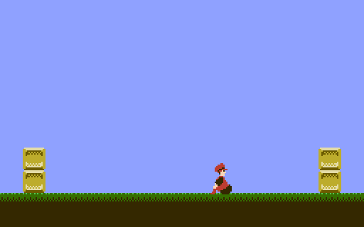

IF THIS FILE HAS NO LINE BREAKS:  View it in a web browser.  
(Some text editors do not understand UNIX-style line breaks.)

NROM template
=============

This is a minimal working program for the Nintendo Entertainment
System using the NROM-128 board.

Concepts illustrated:

* init code
* setting up a static background
* structure of a game loop
* DPCM-safe controller reading
* 8.8 fixed-point arithmetic
* acceleration-based character movement physics
* sprite drawing and animation, with horizontal flipping
* makefile-controlled conversion of sprite sheets

Setting up the build environment
--------------------------------
You'll need the following software installed to build this demo:

* ca65 and ld65, the assembly language tools that ship
  with the cc65 C compiler
* Python, a programming language interpreter
* Pillow (Python Imaging Library), a Python extension to read and
  write bitmap images
* GNU Make, a program to calculate which files need to be
  rebuilt when other files change
* GNU Coreutils, a set of simple command-line utilities for
  file management and text processing

It also requires general familiarity with the command prompt.
Many tools used by programmers have a command-line interface (CLI).
Though this may be unfamiliar to long-time users of graphical user
interfaces (GUI), a CLI tool is easier to include in an automated
process of building an NES game from source code.
You are encouraged to read and understand the articles on general
computer science topics listed at "[Before the basics]" on NESdev Wiki.

[Before the basics]: https://www.nesdev.org/wiki/Before_the_basics

### On Linux

To install Make, Python 3, and Pillow under Ubuntu:

1. Open a terminal.
2. Type the following, followed by the Enter key:

        sudo apt install build-essential python3-pil

3. Type your password to authorize the installation.

To install Make, Python 3, and Pillow under Fedora:
(instructions suggested by jroatch; not tested; maybe outdated)

1. Open a terminal and use `su` to become root.
2. Type the following, followed by the Enter key:

        yum install make automake gcc gcc-c++ python3 python3-pillow

Because cc65 is a fairly niche tool, and because part of the
package once had non-free restrictions on distribution, your
Linux distribution's default repository might not provide cc65.
If not, you can install it from source code.

1. Visit [cc65 on GitHub].
2. Click Download ZIP
3. Unzip into a new folder.
4. In a terminal issue the following commands (suggested by jroatch):

        cd [path to where you unzipped cc65]
        make
        make install PREFIX="$HOME/.local"

   There's no `./configure` step, and the `PREFIX` is case sensitive.

5. Insert the following in your `.bash_profile` or `.bashrc` file,
   to automatically add the local executables to your `PATH` the next
   time you log in.

        if [ -d "$HOME/.local/bin" ] ; then
            PATH="$HOME/.local/bin:$PATH"
        fi

[cc65 on GitHub]: https://github.com/cc65/cc65

### On Windows

`PATH` is an environment variable that tells the command prompt which
folders to look in when you type a program name.  The convention on
UNIX is to install all programs to a handful of folders.  On Windows,
it's more common to install programs to separate folders, with one
folder for each package, and then add each package's folder to `Path`
for Windows to find it.

Because the steps for setting `Path` differ between Windows versions,
you'll want to search the web for `windows x.x path variable`,
replacing `x.x` with `7`, `8.1`, `10`, etc.
In particular, Windows 10 makes adding folders to `Path` more
convenient than previous Windows versions.  [Architect Ryan's guide]
has screenshots of the following process:

1. Open the Start Menu.
2. Type `environment`.
3. Choose "Edit environment variables for your account".
4. Under "User variables", select `Path` and click "Edit..."
5. In "Edit Environment Variables`, add `%USERPROFILE%\bin`.

User variables take effect after you restart the Command Prompt or
Git Bash.  System variables take effect after you restart Windows.

If your PC can run Windows Subsystem for Linux (WSL) 2, install WSL
with Ubuntu and follow the Linux instructions above.  Otherwise,
you'll be installing MSYS2, a port of Make, Coreutils, Bash, and
other key parts of the GNU operating environment to Windows.
[Git for Windows] includes Bash and Coreutils.  If you're installing
Git for the first time, keep the default settings except for two.

- If you don't know what a `:wq` is, change the editor from Vim
  to something else.
- On "Configuring the terminal emulator to use with Git Bash",
  select "Use Windows' default console window" instead of MinTTY
  so that you can see the output of `make` without needing to
  prefix most commands with `winpty`.

To add Make, follow [evanwill's instructions] to
download the latest Make without Guile from [ezwinports] and merge
it into `C:\Program Files\Git\mingw64`.  This method adds to `Path`
a folder called `bin` directly inside your user profile folder, such
as `C:\Users\Pino\bin`, so you can put things like `ca65.exe` there.

Another way to install MSYS is through the automated installer
provided by devkitPro.  This method may be more convenient if you
also develop for Game Boy Advance or Nintendo DS.

1. Visit [devkitPro Getting Started].
2. Follow the instructions there to download and run the
   devkitPro Automated Installer.
3. Uncheck devkitARM, devkitPPC, devkitPSP, and libraries for newer
   platforms (libnds, etc.) unless you plan to start developing for
   one of those soon.  Leave Minimal System (MSYS) checked.

To install Python under Windows:

1. Visit [Python home page].
2. Under Downloads, click Windows.
3. Scroll down to Python 3.11.4 (or the latest
   3.x release), then under that, click Windows installer
   (64-bit).  (If you use 32-bit Windows, use the 32-bit
   installer instead.  If you use Windows 7 or Windows 8.1,
   use Python 3.8.16.)
4. In your web browser's downloads folder, run the downloaded
   installer, whose name should resemble `python-3.8.2-amd64.exe`.
5. Follow the prompts through the installer wizard.

Python's installer also puts `py.exe` into `Path` for you.

To install [Pillow] under Windows, open a Command Prompt and enter
the following command:

    py -m pip install Pillow

To install cc65 under Windows:

1. Visit [cc65 introduction].
2. Scroll to the bottom.
3. Click "Windows Snapshot" to download a zip file.
4. Open the zip file.
5. Inside the zip file, open the bin folder.
6. Drag `ca65.exe`, `ld65.exe`, and `od65.exe` into a new folder.

To make `ca65` and `ld65` available to Make, you'll need to add the
folder containing `ca65.exe` and `ld65.exe` to `Path` or put them in
a folder already on `Path`.  Though `od65.exe` is not required to
build nrom-template, some programs that use a mapper need `od65` to
determine which bank everything goes in.

If `make nrom-template.nes` prints "up to date" and `make run` prints
"command not found", the makefile is trying to run the built ROM in
an emulator.  Open the makefile in a text editor and
change `EMU` to the path of your preferred emulator.

If `make` prints nothing, not even "command not found" or "No targets
specified and no makefile found", then you may have accidentally
downloaded and installed Make with Guile.  Download the version
_without Guile_ and try again.

To get `make dist` to build a zipfile, you'll need to install the Zip
and UnZip command-line tools published by [Info-ZIP].  Be careful, as
`unz600xn.exe` is a self-extracting archive that extracts multiple
files to the current directory, like a tarbomb, so run it in a new
folder and then copy `zip.exe` and `unzip.exe` to a folder on `Path`.

[Architect Ryan's guide]: https://www.architectryan.com/2018/03/17/add-to-the-path-on-windows-10/
[Git for Windows]: https://git-scm.com/download/win
[evanwill's instructions]: https://gist.github.com/evanwill/0207876c3243bbb6863e65ec5dc3f058
[ezwinports]: https://sourceforge.net/projects/ezwinports/files/
[devkitPro Getting Started]: http://devkitpro.org/wiki/Getting_Started
[Python home page]: https://www.python.org/
[Pillow]: https://pypi.python.org/pypi/Pillow
[cc65 introduction]: http://cc65.github.io/cc65/
[Info-ZIP]: ftp://ftp.info-zip.org/pub/infozip/win32/

Organization of the program
---------------------------

### Include files

* `nes.inc`: Register definitions and useful macros
* `global.inc`: Global variable and function declarations

### Source code files

* `nrom.s`: iNES header for NROM
* `init.s`: PPU and CPU I/O initialization code
* `main.s`: Main program
* `bg.s`: Background graphics setup
* `player.s`: Player sprite graphics setup and movement
* `pads.s`: Read the controllers in a DPCM-safe manner
* `ppuclear.s`: Useful subroutines for interacting with the NES PPU

Each source code file is made up of subroutines that start with
`.proc` and end with `.endproc`.  See the [ca65 Users Guide] for
what these mean.

[ca65 Users Guide]: http://cc65.github.io/doc/ca65.html

The tools
---------
In my projects, the `tools` folder contains command-line programs
written in Python to convert graphics into a form usable by the NES.
The makefile contains instructions to run the converter program again
whenever the original asset data changes.

* `pilbmp2nes.py` converts indexed bitmap images in PNG or BMP
  format into tile data usable by several classic video game
  consoles.  It has several options to control the data format; use
  `pilbmp2nes.py --help` from the command prompt to see them all.

Greets
------

* [NESdev Wiki] and forum contributors
* [FCEUX] team
* Joe Parsell (Memblers) for getting me into NESdev in the first place
* Jeremy Chadwick (koitsu) for more code organization tips
* Greg Caldwell of Retrotainment Games for testing the Windows
  instructions

[NESdev Wiki]: http://wiki.nesdev.com/
[FCEUX]: http://fceux.com/

Legal
-----
The demo is distributed under the following license, based on the
GNU All-Permissive License:

> Copyright 2011-2016 Damian Yerrick
> 
> Copying and distribution of this file, with or without
> modification, are permitted in any medium without royalty provided
> the copyright notice and this notice are preserved in all source
> code copies.  This file is offered as-is, without any warranty.

